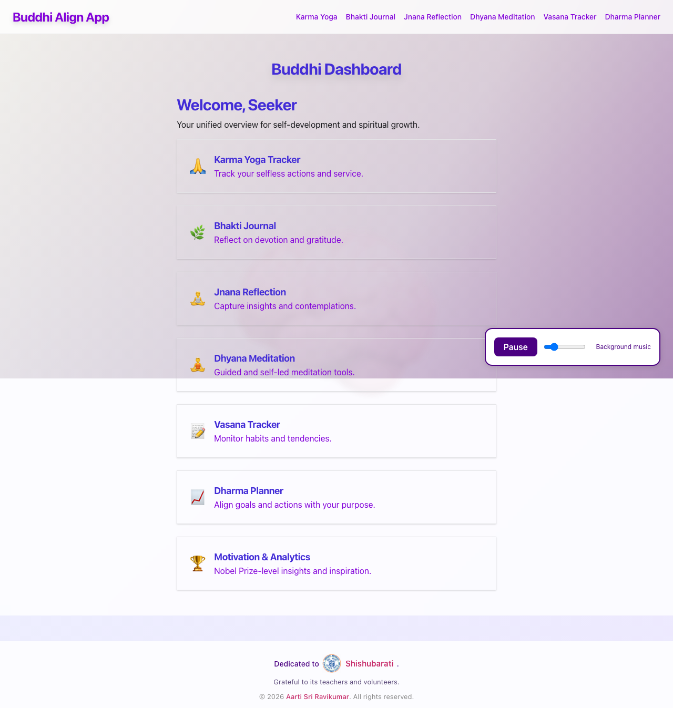
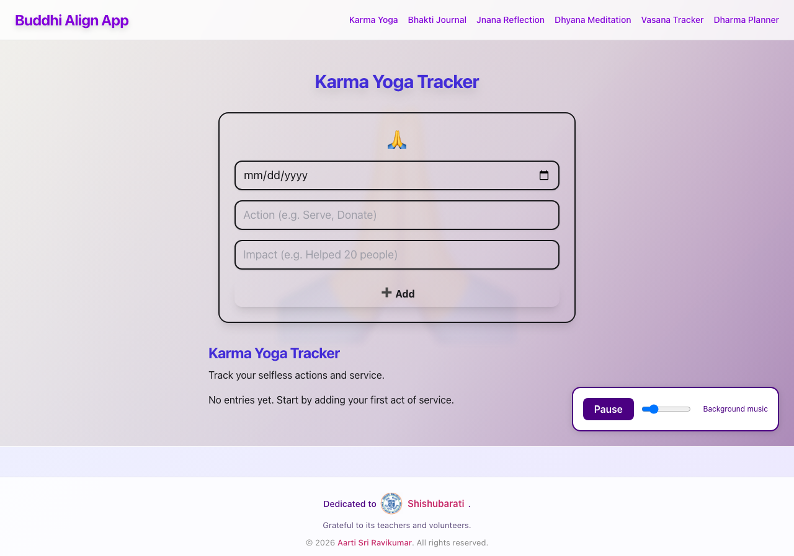
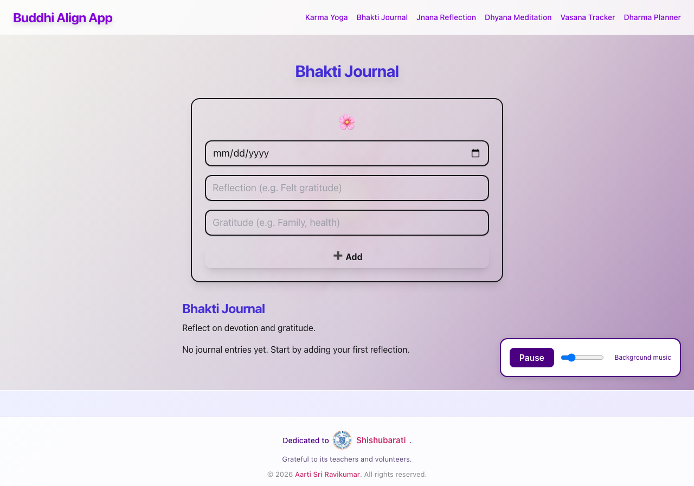
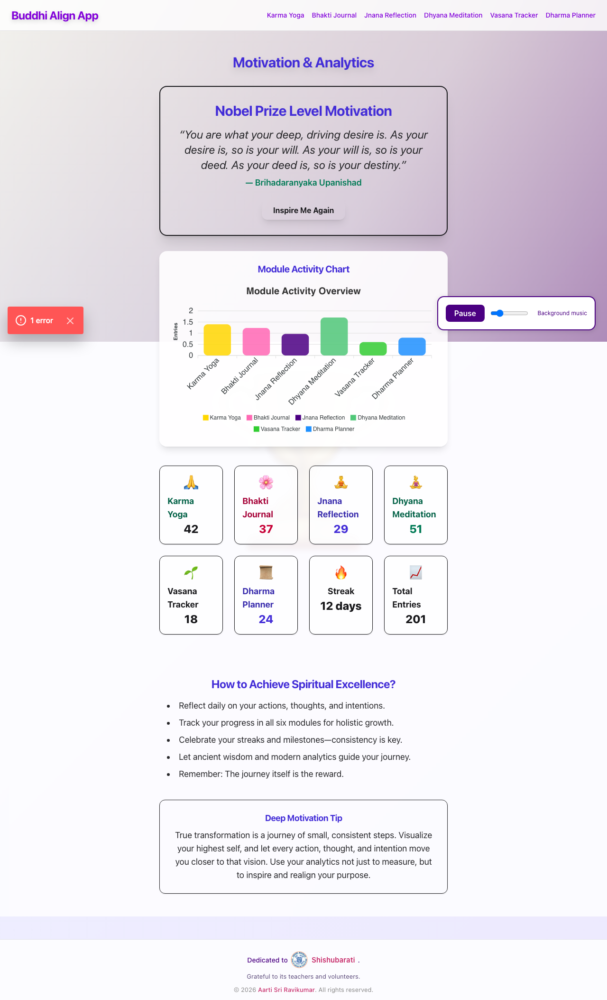

# Buddhi Align App

> Buddhi Yoga as a practical system for clarity, self-regulation, and purposeful daily action.

[](https://www.shishubharati.net/)

This project is dedicated to **Shishubharati**.

The author is deeply grateful to the teachers and volunteers of Shishu Bharati for their guidance, service, and living example of values-centered education.

Website: [https://www.shishubharati.net/](https://www.shishubharati.net/)

## Abstract
Buddhi Align App is a contemplative technology platform that operationalizes Buddhi Yoga principles into measurable, daily practice. The project combines philosophical depth with modern engineering rigor: modular architecture, testable boundaries, clear quality gates, and reproducible development workflows. Its objective is to support inner clarity through structured action, reflective observation, and habit-aware guidance.

## App Screenshots
Click the section below to expand and view full images.

<details>
<summary><strong>Expand Screenshot Gallery (click to view full images)</strong></summary>

<br />

<table>
  <tr>
    <td align="center">
      <a href="docs/screenshots/dashboard-home.png">
        
      </a>
      <br />
      <strong>Dashboard Home</strong>
    </td>
    <td align="center">
      <a href="docs/screenshots/karma-yoga.png">
        
      </a>
      <br />
      <strong>Karma Yoga Module</strong>
    </td>
  </tr>
  <tr>
    <td align="center">
      <a href="docs/screenshots/bhakti-journal.png">
        
      </a>
      <br />
      <strong>Bhakti Journal Module</strong>
    </td>
    <td align="center">
      <a href="docs/screenshots/motivation-analytics.png">
        
      </a>
      <br />
      <strong>Motivation and Analytics Module</strong>
    </td>
  </tr>
</table>

</details>

## Table of Contents
- [Buddhi Align App](#buddhi-align-app)
  - [Abstract](#abstract)
  - [App Screenshots](#app-screenshots)
  - [Table of Contents](#table-of-contents)
  - [Project Overview](#project-overview)
  - [Problem Statement and Scope](#problem-statement-and-scope)
    - [Problem](#problem)
    - [Scope](#scope)
    - [Out of Scope (Current)](#out-of-scope-current)
  - [Vision and Design Principles](#vision-and-design-principles)
  - [Theoretical Foundation](#theoretical-foundation)
    - [Four Practice Lenses Implemented in the App](#four-practice-lenses-implemented-in-the-app)
  - [Feature Modules](#feature-modules)
  - [Architecture](#architecture)
    - [Runtime Model](#runtime-model)
    - [Architectural Rationale](#architectural-rationale)
  - [Repository Structure](#repository-structure)
  - [Technology Stack](#technology-stack)
  - [Quick Start](#quick-start)
    - [Prerequisites](#prerequisites)
    - [Install](#install)
    - [Run development environment](#run-development-environment)
    - [Open application](#open-application)
  - [Scripts and Development Workflows](#scripts-and-development-workflows)
    - [Recommended local quality loop](#recommended-local-quality-loop)
  - [Backend API Contract](#backend-api-contract)
    - [Health/banner](#healthbanner)
    - [Module resources](#module-resources)
    - [Data behavior notes](#data-behavior-notes)
  - [Data Lifecycle and Privacy Model](#data-lifecycle-and-privacy-model)
    - [Data classes](#data-classes)
    - [Storage model](#storage-model)
    - [Privacy posture](#privacy-posture)
  - [Testing and Quality Gates](#testing-and-quality-gates)
  - [Security Notes](#security-notes)
  - [Operational Excellence Checklist](#operational-excellence-checklist)
  - [Roadmap and Future Research](#roadmap-and-future-research)
  - [Contribution Guide](#contribution-guide)
  - [Author and Acknowledgments](#author-and-acknowledgments)
  - [References](#references)
  - [License](#license)

## Project Overview
**Buddhi Align App** is a maintainable monorepo that translates Buddhi Yoga principles into practical digital tools. It helps users align intellect, emotion, and action through structured reflection and habit-aware practice.

The app is organized into focused modules (karma, bhakti, jnana, dhyana, vasana, dharma), with an optional backend API for CRUD operations and a reusable UI package for consistency across screens.

## Problem Statement and Scope
### Problem
Most productivity and self-improvement tools optimize output volume, not psychological alignment. Users often gain activity while losing clarity.

### Scope
Buddhi Align focuses on:
- Reflection quality over task quantity.
- Intention tracking over superficial streak metrics.
- Module-level extensibility without architectural coupling.

### Out of Scope (Current)
- Multi-user identity and cloud sync.
- Long-term persistent backend storage.
- Clinical or therapeutic claim frameworks.

## Vision and Design Principles
- **Clarity first:** UI and workflows emphasize reflection and intentionality over distraction.
- **Modularity:** New modules can be added without destabilizing existing features.
- **Accessibility and inclusivity:** Components are built to be readable and operable across devices.
- **Privacy-first defaults:** No analytics tracking is enabled by default.
- **Maintainability:** Workspace scripts, test hooks, and package boundaries are explicit and reproducible.

## Theoretical Foundation
The project is inspired by the Bhagavad Gita and Vedantic interpretation of human psychology.

- **Buddhi**: discriminative intelligence that guides meaningful action.
- **Manas**: reactive mind shaped by sensory impressions and emotional patterns.
- **Vasanas**: latent tendencies that drive repeated behavior.

The operating premise is practical: when action is intentional, selfless, and observed with awareness, reactive conditioning decreases and psychological clarity increases.

### Four Practice Lenses Implemented in the App
1. **Karma Yoga:** Action without fixation on outcomes.
2. **Bhakti:** Devotional orientation and gratitude.
3. **Jnana:** Inquiry, self-observation, and identity clarity.
4. **Dhyana:** Focused attention and contemplative stillness.

## Feature Modules
- **Buddhi Dashboard:** Central launcher and progress context.
- **Karma Yoga Tracker:** Track service-oriented action.
- **Bhakti Journal:** Record gratitude and devotional reflections.
- **Jnana Reflection:** Capture insight and contemplative thought.
- **Dhyana Meditation:** Support guided and self-led practice.
- **Vasana Tracker:** Observe habit loops and triggers.
- **Dharma Planner:** Align action items with role and purpose.
- **Motivation and Analytics:** Present progress patterns and encouragement.

## Architecture
The repository is a workspace monorepo with independently versioned app and package units.

```text
apps/
   frontend/           Next.js app (App Router, TypeScript)
   backend/            Express API with in-memory stores
packages/
   shared-ui/          Shared React UI components used by frontend
   site-config/        Shared site/theme/config surface
```

### Runtime Model
- Frontend runs independently as a static-capable Next.js web app.
- Backend is optional for local API-backed workflows.
- Shared packages are consumed through workspace links.

### Architectural Rationale
- **Monorepo:** ensures consistent dependency and quality policy across all modules.
- **Shared UI package:** enforces visual and behavioral consistency.
- **Optional backend:** allows both offline-style and API-backed development workflows.
- **Explicit scripts:** makes CI parity straightforward for local contributors.

## Repository Structure
Key top-level files:
- `package.json`: workspace orchestration scripts.
- `package-lock.json`: reproducible dependency graph.
- `buddhi-align-app.code-workspace`: VS Code workspace definition.

Key app files:
- `apps/frontend/app/page.tsx`: dashboard entry page.
- `apps/backend/index.js`: API bootstrap and route definitions.
- `apps/backend/index.test.js`: backend API test coverage.

## Technology Stack
- **Frontend:** Next.js 14, React 18, TypeScript, Tailwind CSS.
- **Backend:** Node.js, Express 5, CORS middleware.
- **Testing:** Vitest + Testing Library (frontend), Node test runner + Supertest (backend).
- **Monorepo orchestration:** npm workspaces + `npm-run-all`.

## Quick Start
### Prerequisites
- Node.js 18+ recommended.
- npm 9+ recommended.

### Install
```sh
npm install
```

### Run development environment
```sh
npm run dev
```

This starts frontend and backend in parallel.

### Open application
- Frontend: `http://localhost:3000`
- Backend (optional): `http://localhost:4000`

## Scripts and Development Workflows
Run from repository root:

- `npm run dev`: start frontend and backend together.
- `npm run dev:frontend`: start Next.js frontend only.
- `npm run dev:backend`: start Express backend only.
- `npm run lint`: run frontend lint checks.
- `npm test`: run frontend and backend tests.
- `npm run build`: build frontend and run backend build step.

### Recommended local quality loop
```sh
npm run lint && npm test && npm run build
```

## Backend API Contract
Base URL: `http://localhost:4000`

### Health/banner
- `GET /` -> plain text: `Buddhi Align App Backend API`

### Module resources
Supported modules:
- `karma`
- `bhakti`
- `jnana`
- `dhyana`
- `vasana`
- `dharma`

For each module `<mod>`:
- `GET /api/<mod>`: list entries.
- `POST /api/<mod>`: create entry; server assigns `id`.
- `PUT /api/<mod>/:id`: update existing entry.
- `DELETE /api/<mod>/:id`: delete entry.

### Data behavior notes
- Storage is in-memory only and resets on server restart.
- `PUT` and `DELETE` return `404` when ID is not found.

## Data Lifecycle and Privacy Model
### Data classes
- **Reflection entries:** user-provided text records across module workflows.
- **Derived context:** UI-level summaries and display transformations.

### Storage model
- Default backend storage is volatile in-memory state for local development.
- Restarting backend clears runtime data by design.

### Privacy posture
- No tracking analytics are enabled by default.
- No automatic third-party export pipeline is included.
- Users retain control over where and how deployment data is hosted.

## Testing and Quality Gates
- Frontend tests are under `apps/frontend/app/**/*.test.tsx`.
- Backend tests are under `apps/backend/*.test.js`.

Current CI-equivalent local checks:
1. Linting passes (`next lint`).
2. Frontend tests pass (`vitest run`).
3. Backend API tests pass (`node --test`).
4. Production build succeeds (`next build`).

## Security Notes
- Dependency scanning should be run periodically with:

```sh
npm audit --omit=dev
```

- Some advisories may require major-version upgrades. Handle these through controlled migrations with regression checks.

## Operational Excellence Checklist
- Clear build, lint, and test gates exist and are script-addressable.
- Frontend and backend have independent test execution paths.
- Module boundaries are explicit through workspace package topology.
- Documentation includes architecture, API contract, and development lifecycle.
- Reproducibility is enforced by lockfile and workspace scripts.

## Roadmap and Future Research
1. Add persistent storage adapters with explicit migration boundaries.
2. Expand frontend test coverage to route-level and component integration depth.
3. Introduce observability hooks for non-invasive quality diagnostics.
4. Add export/import flows for user-owned reflection archives.
5. Explore longitudinal insight models grounded in ethical AI and interpretability.

## Contribution Guide
1. Create a branch for your change.
2. Keep modules and packages scoped; avoid cross-cutting edits unless necessary.
3. Add or update tests for behavior changes.
4. Run `npm run lint && npm test && npm run build` before opening a PR.
5. Keep documentation in sync with code changes.

## Author and Acknowledgments
**Author:** Aarti Sri Ravikumar

**Dedication:** This project is dedicated by **Aarti S Ravikumar** to **Shishubharati**.

**Institution and gratitude:**
- Shishu Bharati School: [https://www.shishubharati.net/](https://www.shishubharati.net/)
- Grateful acknowledgment to the teachers and volunteers for their service and inspiration.
- Intellectual inspiration from the Bhagavad Gita and the works of Swami Chinmayananda and Mahatma Gandhi.

## References
- Bhagavad Gita (classical Hindu scripture).
- Chinmayananda, S. *Holy Geeta*.
- Gandhi, M. K. *The Bhagavad Gita according to Gandhi*.
- Shishu Bharati School: [https://www.shishubharati.net/](https://www.shishubharati.net/)

## License
ISC
